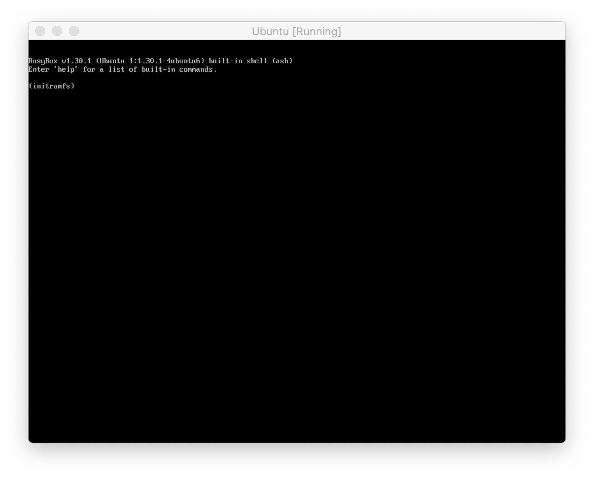

<a href="https://www.buymeacoffee.com/BinaryShrub" target="_blank"></a>

# Ubuntu on BTRFS with LUKS Disk Encryption
This guide walks you through setting up [Ubuntu 20.04 LTS](https://wiki.ubuntu.com/FocalFossa/ReleaseNotes) on [BTRFS](https://btrfs.wiki.kernel.org/index.php/Main_Page) using [GPT](https://en.wikipedia.org/wiki/GUID_Partition_Table), [UEFI](https://en.wikipedia.org/wiki/Unified_Extensible_Firmware_Interface), and [LUKS](https://gitlab.com/cryptsetup/cryptsetup/blob/master/README.md) Disk Encryption.

> [](https://app.diagrams.net/?lightbox=1&highlight=0000ff&edit=_blank&layers=1&nav=1&title=Untitled%20Diagram.drawio#R5Zhdb5swFIZ%2FDZeRAAMjlyVN1krrJoVKu3bAAWsGM8dpyH79jsF8JVRt1CRd10SK7PfYx%2BZ9bAwx0CwrvwpcpA88Jsywzbg00K1h257nwq8S9lpAXi0kgsa1ZHVCSP8QLZpa3dKYbAYNJedM0mIoRjzPSSQHGhaC74bN1pwNRy1wQo6EMMLsWP1JY5nWqu%2BanX5HaJI2I1umjmS4aayFTYpjvutJaG6gmeBc1qWsnBGmvGt8qfstnom2ExMkl6%2FpUFL8Yxl%2Fm9DvD%2FcWYssUPbkTy6%2FTPGG21VesZyv3jQWCb%2FOYqCymgYJdSiUJCxyp6A6Yg5bKjEHNguKa51JTtE1dn3HGRZUL1R%2FQMaNJDloEsydCNaSM9RquXfUFfSMF%2F0V6Ea%2F6QETPnAhJymc9sVqnYYUSnhEp9tCk6dDA0avT8nV917F2mqWY9jhPtYb18kra1B0BKGgIJwBxRnh4DEYNVlBIZHXdtaCsHZDyfm95E5hsKgg30MDyi7ILNlnmi%2FsmEUy0zjXMD3JvzDctiiHb2CV%2B7Iyx9e0VOhtbdMB2eszWH0H75VJox7baRdAqcOq28l%2FjtQ%2B37nvjnV4R73uhXfsRiaIxtCvfdVzzPGiR9TJae%2ByufDG2zWA9uMHjchGCyThTluWrTTFmNpggh442B5%2Bopx0opyg8b9xoPaNxrHoHgsBCwKsqkzK24DSX1YW5geHeqlRbyevF0h69FzonHe9lIt4IEPtiQKzPDcR2%2FjUg9hGQxc0jsj8LEOsVO8S9KpDRJ8kBi3keiX0h4SyAWcxtYzozfPcEQIysPwyfwzOl3UA9PtOr8vGO%2BITh3Qnut29OH8L%2Fw8e1Mf%2Bd8%2FgP1e6tuor1%2FppA878%3D)

### Table of Contents
* [[optional] Setup VirtualBox](#[optional]-Setup-VirtualBox)
* [Install Ubuntu 20.04 on BTRFS with LUKS](#Install-Ubuntu-20.04-on-BTRFS-with-LUKS)
* [Configure Dropbear SSH Client on `/boot` Partition](#Configure-Dropbear-SSH-Client-on-`/boot`-Partition)
* [Dynamically add Drive(s) with BTRFS and RAID](#Dynamically-add-Drive(s)-with-BTRFS-and-RAID)


> This guide was written on `macOS` and may need to be tailored accordingly for other operating systems like `Linux` or `Windows` – contributions are welcome!

<br/>

---

## [optional] Setup VirtualBox
I'd recommend following all sections below on a VM for your first time before doing anything on 'real' hardware. You can iterate faster and learning without breaking your own 💩.

<details><summary><span style="font-weight:bold">CLICK HERE</span> to Setup VirtualBox</summary><p>

### Install VirtualBox
1. Download and install [VirtualBox](https://www.virtualbox.org/wiki/Downloads)
    ``` sh
    brew cask install virtualbox
    ```
### Create a new VM
1. Launch VirtualBox, click `New`:</br></br>**Type:** `Linux`</br>**Version:** `Ubuntu (64-bit)`
    
1. Continue with defaults (which should include a **10 GB** virtual drive)

### Configure and Launch new VM
1. Select VM from step above and click `Settings`
2. Navigate to **System > Motherboard** 
3. Check `Enable EFI (special OSes only)`
    
4. Navigate to **Storage** and attach `ubuntu-20.04-desktop-amd64.iso` as a new Optical Drive:
    
5. Navigate to **Network** and change to `Bridged Adapter` so the VM will get an IP Address from your router instead of your computer:
    
6. [optional] Increase VM performance 
   > I put my numbers below but do what suites you
   
   **Base Memory:** `2048 MB`</br>**Processor(s)** `4`</br>**Video Memory:** `128 MB`
7. Click `OK` to save settings
8. Click `Start`
9.  [optional] Change VM to Scaled Mode (View > Scaled Mode) for a better viewing experience
10. You should be off to the races 🏇</br>


</p></details>
<br/>

---

## Install Ubuntu 20.04 on BTRFS with LUKS
By the end of this section you should have a bare bones Ubuntu system up and running on BTRFS with LUKS. It will be a little rough around the edges (like manually running commands locally to get past LUKS and boot) but it's a start!

<details><summary><span style="font-weight:bold">CLICK HERE</span>  to Install Ubuntu 20.04 on BTRFS with LUKS</summary>
<p>

<p align="center"></p>

### Download Ubuntu 20.04 LTS image
[https://releases.ubuntu.com/20.04/ubuntu-20.04-desktop-amd64.iso](https://releases.ubuntu.com/20.04/ubuntu-20.04-desktop-amd64.iso)
### Launch 'Try Ubuntu' from Installer USB/CD
1. If you are not going the VirtualBox VM route you will need to [build an Ubuntu Live USB](https://ubuntu.com/tutorials/tutorial-create-a-usb-stick-on-ubuntu) from `ubuntu-20.04-desktop-amd64.iso` and launch into it.
2. Start your system, boot to the attached Ubuntu environment, and select `Try Ubuntu` once fully loaded.
3. Open `terminal` (Ctrl+Opt+T on macOS) and run `lsblk` to list out your block devices and locate the drive you will be installing Ubuntu on – in my case `sda`.</br>

    > Jot down your disk name, if it's different than mine, and use it for the remainder of this guide
4. Launch interactive sudo `sudo -i` in terminal – it's time to get our hands dirty 🙌.

### Create Disk Partitions
1. Launch `parted` in interactive sudo to setup a `GPT` partition table and create our three partitions: `EFI`, `/boot`, and `/`.</br>
    ``` sh
    parted /dev/sda
        mklabel gpt
        mkpart primary 1MiB 513MiB
        mkpart primary 513MiB 1026MiB
        mkpart primary 1026MiB 100%
        print
        quit
    ```

    

### Setup LUKS Disk Encryption on `/` partition
1. Setup encryption on `/` partition:
    ``` sh
    cryptsetup luksFormat /dev/sda3
    ```
    > **Use a strong passphrase**: This passphrase is what will be used to unlock your disk encryption in the future – avoid brute force attacks and use something long and strong 😘.
    
    > If you on on VirtualBox, you may get a `Killed` response with a screen flicker, this means luksFormat failed. Try with `--pbkdf-memory 256` to reduce the required memory – not recommended if you can avoid it. 
2. Open your newly created LUKS `/` partition:
   ``` sh
   cryptsetup luksOpen /dev/sda3 sda3_crypt
   ```
   > This will mount an LVM at `/dev/mapper/sda3_crypt` which is affectively your decrypted partition.

### Format Disk Partitions
1. Format `EFI` partition:
    ``` sh
    mkfs.vfat -F 32 /dev/sda1
    ```
2. Format `/boot` partition:
    ``` sh
    mkfs.btrfs /dev/sda2
    ```
1. Format `/` partition:
    ``` sh
    mkfs.btrfs /dev/mapper/sda3_crypt
    ```
    > You do not want to use `/dev/sda3` here because it's encrypted.

### Install Ubuntu 👨‍💻
1. Launch Ubuntu Installer from interactive sudo terminal
   ``` sh
   ubiquity
   ```
   
2. Continue with your desired settings until you hit the **Installation type** page, here you want to select the `Something else` radial button:
    
3. We are now going to tell the Ubuntu installer how/where we want our installation:
    1. Select `/dev/sda1`, press the Change button. Choose Use as `EFI System Partition`.</br>
        > If this is not an option, you probably didn't boot with UEFI Support in VirtualBox or your System doesnt support UEFI 🙁
    2. Select `/dev/sda2`, press the Change button. Choose Use as `btrfs journaling filesystem`, check `Format`, and use `/boot` as Mount point.
    3. Select `/dev/mapper/sda3_crypt`, press the Change button. Choose Use as `btrfs journaling filesystem`, check `Format`, and use `/` as Mount point.
   
    
4. Click `Install Now`
5. Continue through the rest of the installation with your desired settings:
    
6. Remove the Ubuntu Installer USB/CD – it is no longer needed.
7.  Click `Restart Now`
8.  Congrats, Ubuntu is installed on BTRFS with LUKS 🎉 – time for a test drive to see if it works 🚙...

### Launch your new Ubuntu System for the First Time
1. Once booted/restarted you should end up in `initramfs` running `BusyBox` and not Ubuntu. This is because your `/boot` volume could not mount the `/` partition because it's encrypted:
    
2. Perform the following commands to boot into Ubuntu:
   1. Open the encrypted `/` partition
       ``` sh
       cryptsetup luksOpen /dev/sda3 sda3_crypt
       ```
   2. Scan for the `/` partition filesystem
       ``` sh
       btrfs device scan
       ```
   3. Exit to continue the booting process
       ``` sh
       exit
       ```
    
3. If all's good, you should be loaded to Ubuntu!</br>


### Enable SSH
1. Upgrade packages, install a couple more, and enable ssh access:
    ``` sh
    sudo apt update
    sudo apt upgrade -y
    sudo apt install -y net-tools openssh-server curl
    ```
2. Add filewall rule for ssh:
    ``` sh
    sudo ufw allow ssh
    ```
3. Setup `authorized_keys` to gate ssh access:
    ``` sh
    mkdir ~/.ssh
    echo "YOUR_PUBLIC_KEY_HERE" >> ~/.ssh/authorized_keys
    ```
    > Read more about [ssh-keygen](https://www.ssh.com/ssh/keygen/) if needed.
4. You should now be able to ssh into your Ubuntu system:
    ``` sh
    ssh binaryshrub@192.168.1.109
    ```
    > Use `ifconfig` if you need to find the IP Address.

### Additional Configuration
1. [optional] If you are on VirtualBox, you should now install `VirtualBox Guest Additions` and `disable Scaled Mode` to make your experience better.
2. [optional] Trim down on GRUB start time from `30s` to `2s` like default</br>
    ``` sh
    sudo sh -c 'echo GRUB_RECORDFAIL_TIMEOUT=2 >> /etc/default/grub'
    sudo update-grub
    ```
    


</p></details>

<br/>

---

## Configure Dropbear SSH Client on `/boot` Partition

> COMING SOON!

> See [btrfs-luks-unlocker.sh](https://github.com/BinaryShrub/ubuntu-btrfs-luks/blob/master/scripts/btrfs-luks-unlocker.sh) using [dropbear-initramfs](https://packages.ubuntu.com/focal/net/dropbear-initramfs) for a sneak peak...

<br/>

---
## Dynamically add Drive(s) with BTRFS and RAID

> COMING SOON!

<br/>

---